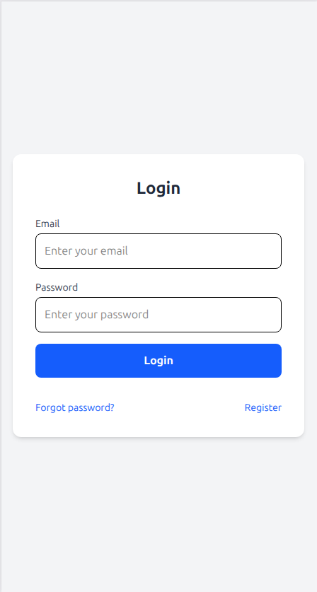
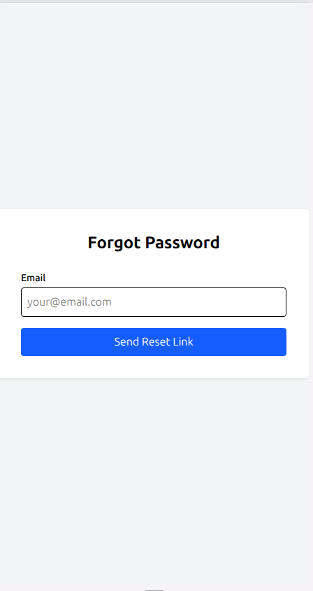
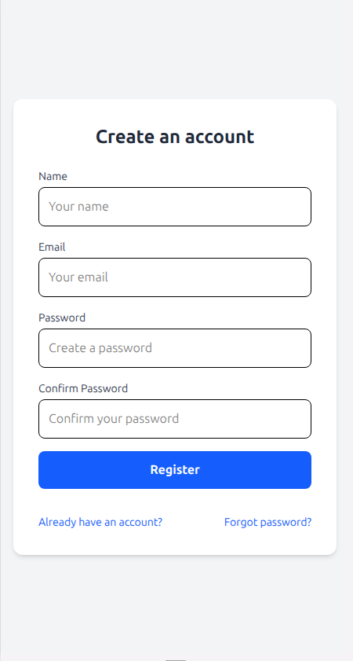
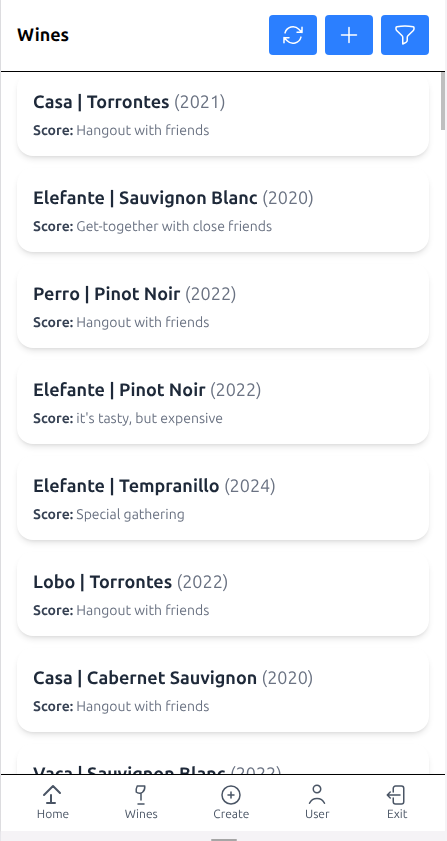
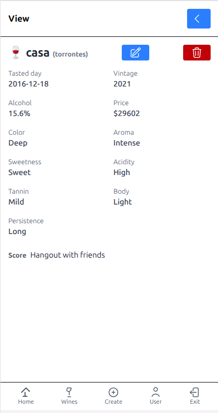
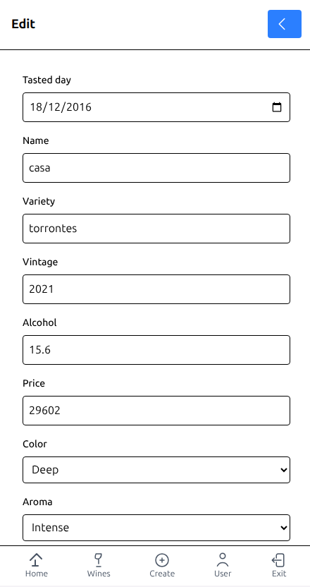
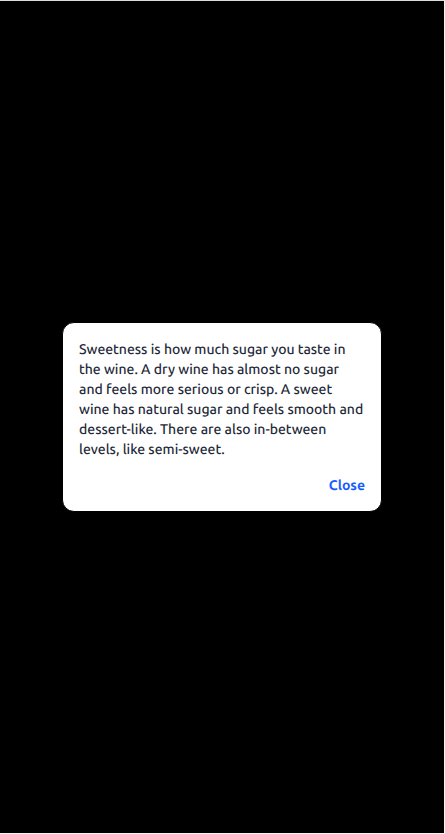

# 🍷 Wine App Backend

Backend for the Wine App built with **Laravel**, **MySQL**, and **Sanctum**.\
This API provides authentication, CRUD operations for wines, and is designed to be consumed by the Wine Vue frontend.

🔗 **Backend repository:** [wine-laravel-app](https://github.com/guduchango/wine-laravel-app)\
🔗 **Frontend repository:** [wine-vue-app](https://github.com/guduchango/wine-vue-app)\
🌐 **My website:** [edgardoponce.com](https://edgardoponce.com)

---

## 📦 What does this project include?

✅ Laravel 10 REST API\
✅ Sanctum for authentication\
✅ CRUD endpoints for wines\
✅ User registration and login\
✅ Seeder and factory for wines\
✅ API resource responses\
✅ CORS configured for frontend integration

---

## 🚀 How to start the backend project

1. Clone the backend repository:

   ```bash
   git clone https://github.com/guduchango/wine-laravel-app.git
   cd wine-laravel-app
   ```

2. Install PHP dependencies:

   ```bash
   composer install
   ```

3. Copy the environment file:

   ```bash
   cp .env.example .env
   ```

4. Configure `.env` with your MySQL credentials and mail settings if needed.

5. Generate the application key:

   ```bash
   php artisan key:generate
   ```

6. Run database migrations and seeders:

   ```bash
   php artisan migrate --seed
   ```

7. Start the local server:

   ```bash
   php artisan serve
   ```

The API will be available at: [http://127.0.0.1:8000](http://127.0.0.1:8000)

---

## 🗂 Backend folder structure

```
wine-laravel-app/
├── app/
│   ├── Http/Controllers/   API controllers
│   ├── Models/             Eloquent models
├── database/
│   ├── factories/          Model factories
│   ├── seeders/            Database seeders
├── routes/
│   └── api.php             API routes
├── storage/                Logs and uploads
└── .env                    Environment configuration
```

---

## 📸 Screenshots

Add your screenshots inside a `/docs/` folder in the repo and reference them like this:

### 🔑 Auth Screen

<p align="center">
  
</p>

<p align="center">
  
</p>

<p align="center">
  
</p>

---

### 🍷 Wine

<p align="center">
  
</p>

<p align="center">
  
</p>

<p align="center">
  
</p>

<p align="center">
  
</p>


---

### 🔗 API Wine List Endpoint Test


---

## 🎨 Technologies Used

- Laravel
- Sanctum
- MySQL
- PHPUnit (for tests)

---

## 🎯 How to contribute

1. Fork the repo
2. Create your branch: `git checkout -b feature/my-feature`
3. Commit your changes: `git commit -m "Add my feature"`
4. Push to your fork: `git push origin feature/my-feature`
5. Open a pull request

Contact: [edgardoponce.com](https://edgardoponce.com) or open an issue.

---

## 📄 License

This project is licensed under the MIT License.

---
